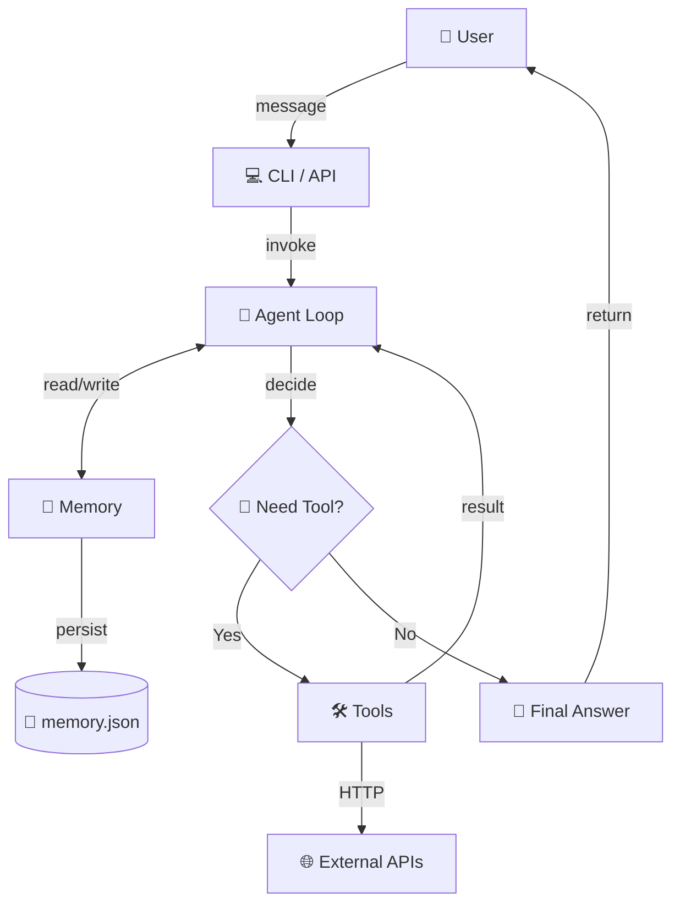

# AI Agent Starter 🚀
**Production-ready Python AI Agent — clone แล้วรันได้ใน 30 นาที**

> 🤖 ReAct agent pattern + tool calling + memory + multi-provider support  
> 🎯 เป้าหมาย: นักพัฒนา Python ที่อยากได้ AI agent ที่รันได้จริง ไม่ใช่แค่ demo  
> 💼 License: MIT — ใช้เชิงพาณิชย์ได้ ขายต่อได้ แก้ไขได้

---

## ✨ Features

- ✅ **ReAct Agent Loop** — reasoning + acting แบบ iterative
- ✅ **Multi-Provider** — รองรับ OpenAI, Anthropic, Google Gemini
- ✅ **Tool Calling** — เพิ่ม tools ได้ง่าย ๆ (มี 4 ตัวอย่าง)
- ✅ **Memory** — short-term (context) + long-term (JSON persistence)
- ✅ **Production-ready** — error handling, retry, logging
- ✅ **Minimal deps** — แค่ `requests` + provider SDK
- ✅ **No LangChain** — เขียนเอง เข้าใจง่าย แก้ไขง่าย ไม่ vendor lock-in

---

## 🏗️ Architecture



**Flow:**
1. User ส่งข้อความ
2. Agent loop คิด (Reasoning) — ตัดสินใจว่าต้องใช้ tool ไหม
3. ถ้าต้องใช้ tool → เรียก tool → ได้ผลลัพธ์ → กลับมาคิดต่อ
4. ถ้าไม่ต้องใช้ → ตอบคำตอบสุดท้าย
5. บันทึก conversation ลง memory

---

## 📋 Prerequisites

- Python 3.10+ ([ดาวน์โหลด](https://www.python.org/downloads/))
- pip (มาพร้อม Python)
- API key ของ LLM provider (เลือก 1 ตัว):
  - **OpenAI** (แนะนำ) — [สมัคร](https://platform.openai.com/api-keys)
  - **Anthropic Claude** — [สมัคร](https://console.anthropic.com/)
  - **Google Gemini** (ฟรี!) — [สมัคร](https://aistudio.google.com/app/apikey)

**ไม่ต้องมี GPU, ไม่ต้องมี server, ไม่ต้องมี Docker** (แต่ deploy ได้)

---

## 🚀 Quickstart (30 นาที)

### 1. Clone & Install (3 นาที)

```bash
git clone https://github.com/yourname/ai-agent-starter.git
cd ai-agent-starter
cd code
pip install -r requirements.txt
```

หรือใช้ venv (แนะนำ):
```bash
python -m venv venv
source venv/bin/activate  # Windows: venv\Scripts\activate
pip install -r requirements.txt
```

### 2. ตั้งค่า API Key (2 นาที)

```bash
cp .env.example .env
# แก้ .env ใส่ API key ของคุณ
```

`.env` ตัวอย่าง:
```bash
# เลือก provider เดียว (หรือใส่หลายตัวก็ได้)
OPENAI_API_KEY=sk-...
ANTHROPIC_API_KEY=sk-ant-...
GOOGLE_API_KEY=AIza...

# เลือก default provider
LLM_PROVIDER=openai
LLM_MODEL=gpt-4o-mini

# ตั้งค่า agent
AGENT_MAX_ITERATIONS=10
AGENT_TEMPERATURE=0.7
MEMORY_FILE=./memory.json
```

### 3. ทดสอบ (1 นาที)

```bash
python agent_loop.py
```

พิมพ์: `หาข้อมูล weather Bangkok` หรือ `คำนวณ 25 * 4 + 100`

### 4. รัน Demo (3 นาที)

```bash
# ใช้ system prompt สำหรับ Thai customer service
python agent_loop.py --system prompts/system-prompt.md
```

---

## 📁 Project Structure

```
ai-agent-starter/
├── README.md                  # ไฟล์นี้
├── ARCHITECTURE.md            # Deep dive: agent loop, tool use, memory
├── DEPLOY.md                  # Deploy บน Railway / Render / Fly.io
├── EXAMPLES.md                # ตัวอย่างการใช้งาน 3 แบบ
├── LICENSE                    # MIT
├── prompts/
│   └── system-prompt.md       # Thai customer-service agent prompt
└── code/
    ├── agent_loop.py          # Main agent loop (ReAct)
    ├── tools.py               # 4 sample tools
    ├── memory.py              # Memory management
    ├── requirements.txt       # Python deps
    ├── .env.example           # API key template
    └── tests/
        └── test_agent.py      # Unit tests
```

---

## 🛠️ Tools ที่มาพร้อม

| Tool | คำอธิบาย | ต้องการ |
|---|---|---|
| `web_search` | ค้นหาข้อมูลจากเว็บ | SerpAPI key (ฟรี 100/เดือน) |
| `calculator` | คำนวณเลข (พร้อม sympy สำหรับ complex) | ไม่ต้อง |
| `read_file` | อ่านไฟล์ในเครื่อง | ไม่ต้อง |
| `send_email` | ส่งอีเมล | SMTP credentials |

**เพิ่ม tool ใหม่:** ดู template ใน `tools.py` แล้วเพิ่ม function ใหม่ + register ใน `TOOL_REGISTRY`

---

## 💬 ตัวอย่างการใช้งาน

### Basic CLI
```bash
$ python agent_loop.py

🤖 AI Agent (OpenAI gpt-4o-mini)
พิมพ์ 'exit' เพื่อออก
พิมพ์ 'clear' เพื่อลบ memory

You: หวัดดี
Agent: สวัสดีครับ! มีอะไรให้ช่วยไหมครับ?

You: คำนวณงบประมาณโครงการ 1,500,000 บาท ถ้าแบ่งจ่าย 12 งวด
Agent: ใช้ tool: calculator({"expression": "1500000 / 12"})
Tool result: 125000
Agent: 1,500,000 บาท ถ้าแบ่งเป็น 12 งวด จะตกงวดละ 125,000 บาทครับ

You: exit
Agent: ขอบคุณที่ใช้บริการ! 👋
```

### As a Library
```python
from agent_loop import Agent
from tools import TOOL_REGISTRY
from memory import Memory

memory = Memory(persist_path="./memory.json")
agent = Agent(
    provider="openai",
    model="gpt-4o-mini",
    system_prompt="คุณเป็น AI ผู้ช่วยอัจฉริยะ",
    tools=TOOL_REGISTRY,
    memory=memory
)

response = agent.run("อธิบาย quantum computing แบบเข้าใจง่าย")
print(response)
```

### As a REST API
```python
# app.py
from flask import Flask, request, jsonify
from agent_loop import Agent

app = Flask(__name__)
agent = Agent(...)

@app.route("/chat", methods=["POST"])
def chat():
    user_id = request.json.get("user_id")
    message = request.json.get("message")
    response = agent.run(message, user_id=user_id)
    return jsonify({"response": response})

if __name__ == "__main__":
    app.run(host="0.0.0.0", port=8000)
```

ดูตัวอย่าง deploy ใน `DEPLOY.md`

---

## 🧪 Testing

```bash
cd code
pytest tests/
```

หรือรัน manual:
```bash
python tests/test_agent.py
```

Tests ครอบคลุม:
- ✅ Agent loop basic
- ✅ Tool calling
- ✅ Memory persistence
- ✅ Error handling
- ✅ Multi-provider switching

---

## 🎓 เรียนรู้เพิ่มเติม

- **[ARCHITECTURE.md](./ARCHITECTURE.md)** — Deep dive เบื้องหลัง agent loop
- **[EXAMPLES.md](./EXAMPLES.md)** — 3 ตัวอย่างการใช้งานจริง
- **[DEPLOY.md](./DEPLOY.md)** — Deploy production
- **[prompts/system-prompt.md](./prompts/system-prompt.md)** — Production-ready system prompt

---

## 🤝 Contributing

PR ยินดีต้อนรับ! โปรด:
1. Fork repo
2. สร้าง feature branch (`git checkout -b feature/AmazingFeature`)
3. Commit (`git commit -m 'Add: amazing feature'`)
4. Push (`git push origin feature/AmazingFeature`)
5. เปิด Pull Request

---

## 📜 License

MIT License — ใช้เชิงพาณิชย์ได้ ขายต่อได้ แก้ไขได้

---

## 💬 Support

- 📧 Email: support@aifactory.co
- 🐛 Issues: https://github.com/yourname/ai-agent-starter/issues
- 💬 Discord: "AI Builders Thailand"

---

**Built with ❤️ for the AI builder community — June 2026**
